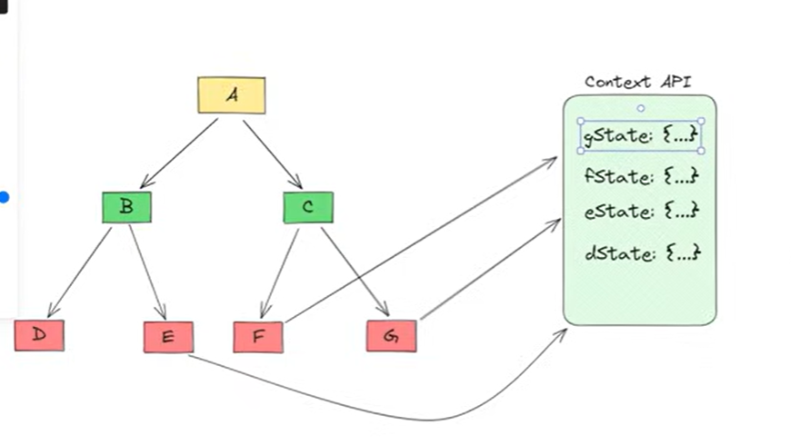
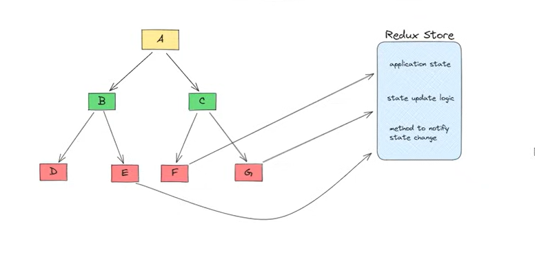

# Redux Fundamentals — Detailed Notes 

---

# 🔥 What is Redux?

**Redux** is a JavaScript library for **predictable global state management**, making state changes easy to understand, debug, and maintain at scale.

---

<table>
  <tr>
    <td align="center">
      
       
      <b>Context API</b>
    </td>
    <td align="center">
      
       
      <b>Redux Store</b>
    </td>
  </tr>
</table>

# Redux Flow Diagram

  

